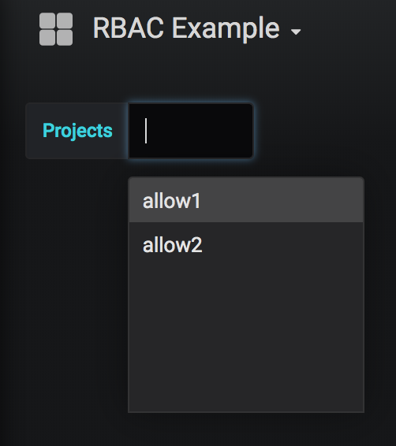

# Summary

This repository shows how to combine Openshift authentication and rolebindings with Grafana. This has been tested on Openshift 3.11. 

We will create a Grafana plugin that will forward the username of the logged in user to a application. This application will check the users rolebindings using the Openshift API and return a list of projects a user can access.

Openshift cluster administrators can then define Grafana dashboards that expose cluster metric stats that are RBAC'd based on a drop down of projects. 

## Deployment

```
# Backend App
oc create sa cluster-reader
oc adm policy add-cluster-role-to-user cluster-reader -z cluster-reader
oc process -f openshift/template.json | oc apply -f- 
oc import-image devtools/go-toolset-rhel7 --from=registry.access.redhat.com/devtools/go-toolset-rhel7 --confirm

# Grafana Dashboard
oc create serviceaccount grafana
oc create secret generic grafana-proxy --from-literal=session_secret=$(openssl rand -base64 13)
oc create secret generic grafana-config --from-file=openshift/grafana.ini
oc create -f openshift/grafana-dashboards.json
oc create secret generic grafana-datasources --from-file=openshift/grafana-datasources.yaml
oc adm policy add-cluster-role-to-user system:auth-delegator -z grafana
oc create configmap grafana-dashboard-rbac-example --from-file=openshift/rbac-example.json

POD=$(oc get pods | grep grafana | awk '{print $1}')
oc rsync ./grafana-extension/simple-json-datasource-master $POD:/var/lib/grafana/plugins/
oc delete pod $POD
```


# Test

## User setup example

We use a htpasswd backed repository so we need to add a user manually. 

By default explicit view role is required for the drop down to be populated. 
```
htpasswd -b /etc/origin/master/htpasswd test test
oc create user test
```

## Standard rolebinding setup

In the example below user test will be available to view projects allow1 and allow2 but not block1. As we have given view permissions to the user. 

```
oc new-project allow1
oc new-project allow2
oc new-project block1
oc adm policy add-role-to-user view test -n allow1
oc adm policy add-role-to-user view test -n allow2
```

For testing we expose the backend application as a route. In production this would not be exposed. 
```
curl http://admin-app-iw.apps.cacb.example.opentlc.com/search -X POST -H "Content-Type: application/json" --data '{"username":"test"}' -k
```


